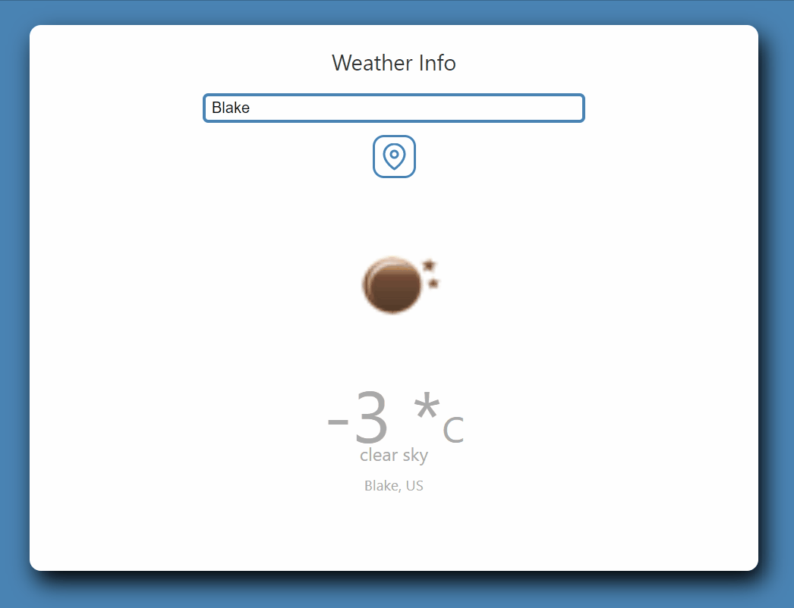

# Demo

# Source code
[Here](https://github.com/thangdc1982/weather-app-react)

# Introduction
In this article, we will learn to build the weather app using 
1. [React function component](https://reactjs.org/docs/components-and-props.html)
2. [React hooks](https://reactjs.org/docs/hooks-intro.html)
3. [React data management context api](https://reactjs.org/docs/context.html)

# Prerequiestes
* Install Visual Studio Code (VS Code) from [here](https://code.visualstudio.com/download)
* Install NodeJS from [here](https://nodejs.org/en/download/)
* Create account for open weather api [here](https://openweathermap.org/)

# Create project
Create weather app project
```
npx create-react-app weather-app
```
The command above will create a new React project with the name `weather-app`

Change the directory to the new project
```
cd weather-app
```
Let run the application to make sure, the project was created successfully by using the command
```
npm start
```
## Install the dependencies
I am using the feather icons for any icons using in the project. All the icons can be found [here](https://feathericons.com/)
To add the feather icons to the react prject we are using the command
```
npm i react-feather
```
The usage for react-feather icon can be seen [here](https://github.com/feathericons/react-feather)

# Open the project in VS Code
Open the project in VS Code
```
code .
```

# Update the CSS style
Because this is a simple project, therefore I put all the style code in one single file App.css.
Replace all the content in the App.css with the content from [App.css](https://github.com/thangdc1982/weather-app-react/blob/master/src/App.css)

# Create reducers
Make a new folder `reducers` under the `src` directory.
Then make a new `index.js` under the `reducers` folder.
Copy the following code the `index.js` file
```Javascript
export const getWeather = async (api) => {
    const response = await fetch(api);
    if (!response.ok) {
        // throw an error if response has not successed
      throw new Error(`${response.status}, ${response.statusText}`);
    } else {
        return await response.json();
    }
}

export const updateWeather = (dispatch, data) => {
    let weather = {};
    weather.temprature = {
        unit: "celsius"
    };
    weather.temprature.value = Math.floor(data.main.temp - KELVIN);
    weather.description = data.weather[0].description;
    weather.iconId = `http://openweathermap.org/img/w/${data.weather[0].icon}.png`;
    weather.city = data.name;
    weather.country = data.sys.country;          
    

    dispatch({
        type: "UPDATE_WEATHER",
        payload: weather
    });
};

export const KEY = "This is the key from your account openweather";

export const KELVIN = 273;

const reducer = (state, action) => {
    const { type, payload } = action;        
    switch (type) {                     
        case "SET_ERROR": 
            return {
                ...state,
                error: payload.error,
                city: payload.city,
                weather: null
            };
        case "SET_LOCATION":
            return {
                ...state,
                latitude: payload.latitude,
                longitude: payload.longitude
            };
        case "UPDATE_WEATHER":
            return {
                ...state,                
                weather: payload,
                error: null,
                city: payload.city
            };
        default:
            return state;
    }
};

export default reducer;
```
* `getWeather` is to perform the async event to get the data from the open weather with the provided URL as the parameters
* `updateWeather` takes the `dispatch` method, and the data return from the `getWeather` to format data as desired and `dispatch` the method to update the state values.
* `reducer` is defining all the action and payload data to update to the state. There are a total of three actions here
1. `SET_ERROR` will notify the component to display the error message if fails to get the weather
2. `SET_LOCATION` will set the latitude and longitude value from your current location, this is a one-time set. The values will be reused when the location icon is clicked
3. `UPDATE_WEATHER` update the weather information in the state so they will be displayed in the component
# Create StateProvide (store)
Make a new folder `store` under the `src` directory.
Then make a new `index.js` under the `store` folder.
Copy the following code the `index.js` file
```Javascript
import React, { createContext, useContext, useReducer } from 'react';
import reducer from '../reducers';

export const initialState = {
    weather: null,
    latitude: 0.0,
    longitude: 0.0,
    city: "",
    error: null
};

export const StateContext = createContext(initialState);
const { Provider } = StateContext;

export const StateProvider = ({children}) => {
    return <Provider value={useReducer(reducer, initialState)}>{children}</Provider>;
};

export const useStateValue = () => useContext(StateContext);
```
* `initialState` is the initial values of the state
* `reducer` is defined from our reducers
* `useContext` returns the current context value for that context.
# Make use of StateProvide
Open the `index.js` under the `src` folder, and update the script content as below
```Javascript
import React from 'react';
import ReactDOM from 'react-dom';
import './index.css';
import App from './App';
import reportWebVitals from './reportWebVitals';
import { StateProvider } from './store';

ReactDOM.render(
  <React.StrictMode>
    <StateProvider>
      <App />
    </StateProvider>
  </React.StrictMode>,
  document.getElementById('root')
);

// If you want to start measuring performance in your app, pass a function
// to log results (for example: reportWebVitals(console.log))
// or send to an analytics endpoint. Learn more: https://bit.ly/CRA-vitals
reportWebVitals();
```
`App` component is now surrounded by our `StateProvider`. This will make the state available for the whole application.
# Adding Notification component
Notification component is to display the error message.
Create a new file `Notification.js` under the `src` directory
```Javascript
import React from 'react';
import { useStateValue } from './store';

function Notification() {    

    const [{error, city}] = useStateValue();  

    return (
        <div className="notification">
            {error && <p>{error.message}, <b><i>"{city}"</i></b> is not a valid city</p>}
        </div>
    )
}

export default Notification

```
`const [{error, city}] = useStateValue();` allows to access the data from the global state.
# Adding Header/City component
Header/City component is to display the title message, and the input field to allow user to enter the city name. it is also included the button icon to allow re-set the location back to the current location of the user machine.
Create a new file `City.js` under the `src` directory
```Javascript
import React, { useState, useEffect } from 'react';
import { MapPin } from 'react-feather';
import { useStateValue } from './store';
import { getWeather, KEY, updateWeather } from './reducers';

function CityInfo() {
    const [currentCity, setCurrentCity] = useState('');
    const [{city, latitude, longitude}, dispatch] = useStateValue();    

    useEffect(() => {
        setCurrentCity(city);
    }, []);

    /**
     * Use click on the location button to see the weather
     * at the current location
     */
    const defaultLocation = () => {
        let api = `http://api.openweathermap.org/data/2.5/weather?lat=${latitude}&lon=${longitude}&appid=${KEY}`;
        getWeatherData(api);
    };

    /**
     * Key up event to capture keyboard
     * Firing to update the city in the store if the key is Enter
     */
    const onCityChange = (event) => {
        if (event.keyCode === 13) {
            event.preventDefault();           
            let api = `http://api.openweathermap.org/data/2.5/weather?q=${currentCity}&appid=${KEY}`;    
            getWeatherData(api);
        }
    };

    const getWeatherData = (api) => {
        getWeather(api)
        .then((data) => {    
            setCurrentCity(data.name); 
            updateWeather(dispatch, data);
        })
        .catch (e => {            
            dispatch({
                type: "SET_ERROR",
                payload: {
                    error: e,
                    city: currentCity
                }
            }); 
        }); 
    };

    /**
     * Handle the input change
     */
    const handleChange = (event) => {
        setCurrentCity(event.target.value);
    }

    return (
        <div className="app-title">
            <p>Weather Info</p>
            <input type="text" placeholder="Enter the city" autoComplete="off" 
            onChange={handleChange}
            value={currentCity} onKeyUp={onCityChange} />
            <div className="location-icon" onClick={defaultLocation}>
                <MapPin />
            </div>        
        </div>
    )
}

export default CityInfo;
```
`const [currentCity, setCurrentCity] = useState('');` is to keep the value which user is entering in the input field
`const [{city, latitude, longitude}, dispatch] = useStateValue();` allows to access data from global state. There is `dispatch` is the method paired with the state, the `dispatch` will be passed to the call-back methods to update the state. 
# Adding WeatherInfo component
WeatherInfo component is to display the weather data.
Create a new file `WeatherInfo.js` under the `src` directory
```Javascript
import React from 'react';
import { useStateValue } from './store';

function WeatherInfo() {
    const [{weather}] = useStateValue();

    return weather && (
        <div className="weather-container">
            <div className="weather-icon">
              
              <div className="temprature-value">
                <p>{weather.temprature.value} *<span>C</span></p>
              </div>
              <div className="temprature-description">
                <p>{weather.description}</p>
              </div>
              <div className="location">
                <p>{weather.city}, {weather.country}</p>
              </div>
            </div>          
        </div>
    )
}

export default WeatherInfo;

```
`const [{weather}] = useStateValue();` allows to access the weather data from the global state.
# Update the App.js
Now we have all the components, we will add them to our main app component
```Javascript
import React, { useEffect } from 'react';
import './App.css';
import { useStateValue } from './store';
import Notification from './Notification';
import WeatherInfo from './WeatherInfo';
import CityInfo from './CityInfo';
import { getWeather, KEY, updateWeather } from './reducers';

function App() {
  const [{error}, dispatch] = useStateValue();  

  useEffect(() => {     
    if ("geolocation" in navigator) {
      navigator.geolocation.getCurrentPosition((position) => {  
        let payload = {
          latitude: position.coords.latitude,
          longitude: position.coords.longitude
        };
        dispatch({
          type: "SET_LOCATION",
          payload
        });
        let api = `http://api.openweathermap.org/data/2.5/weather?lat=${payload.latitude}&lon=${payload.longitude}&appid=${KEY}`;
        getWeather(api)
        .then((data) => {
          updateWeather(dispatch, data);          
        })
        .catch (e => {            
            dispatch({
              type: "SET_ERROR",
              payload: {
                error: e
              }
            });
        });                   
      }, (error) => {  
        dispatch({
          type: "SET_ERROR",
          payload: {
            error
          }
        });              
      });
    }
  }, []);  

  return (    
    <div className="app">      
      <CityInfo />
      {error && <Notification />}
      {!error && <WeatherInfo />}
    </div>
  );
}

export default App;
```
* `navigator.geolocation.getCurrentPosition` allows to gets the current position of the user, this will prompt the message when launch for accessing the location.
* `{error && <Notification />}` renders if there is an error.
* `{!error && <WeatherInfo />}` renders if there is no error

# Congrats!!!
Congrats!!! You have completed building the weather application from start to end.